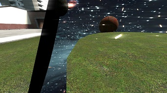
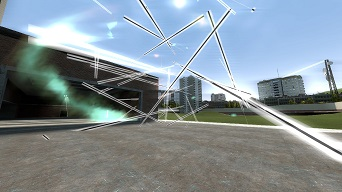
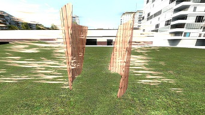
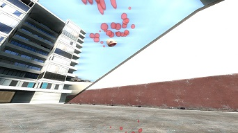

# GMod 领域插件 - 咒术回战风格战斗系统

# 声明

基于《咒术回战》领域设定启发的GMod战斗插件。
动作模型来自于插件: https://steamcommunity.com/sharedfiles/filedetails/?id=3413177769
By Spy Ghost

# 使用方法

## 基本绑定设置

1. 首先需要将领域启动功能绑定到按键上，推荐使用以下控制台命令：
   ```
   bind g "+dm_start fukuma"
   ```
   （此命令将"g"键绑定为启动领域的快捷键）

## 启动步骤

1. 在游戏中装备对应的领域相关物品（在武器选择菜单中找到领域相关选项）
2. 确保你处于可使用状态（未处于CD）
3. 按下你绑定的快捷键（上述示例中为"g"键）即可启动领域


# 对抗设计

## 核心机制

- **领域系统**：通过控制台命令触发的短期球形范围技能
- **可控参数**：玩家可自定义领域范围，影响力由玩家策略决定
- **收益波动**：效果下限可能为短期收益甚至负面效果，上限则带来长期战略优势
- **熔断机制**：使用领域后进入一段无法创建影响的冷却期（时长可通过控制台调整）
- **保险丝实体**：可争夺的资源点，用于快速恢复熔断状态，引发激烈对抗

## 领域对抗策略

当敌方展开领域时，你有三种应对选择：

1. **直接破防**：攻击施术者使其生命值或护甲值低于维持阈值（阈值可通过控制台设置）
2. **战术撤退**：领域启动前有威胁提醒（可开关），及时逃离范围规避影响
3. **领域对抗**：展开自己的领域进行防御或反击
   - 领域相交区域会相互中和，消除所有领域效果
   - 对抗碰撞伤害可通过控制台调整

## 领域类型

### 无量空处
- **影响目标**：NPC和所有玩家（包括队友）
- **效果组合**：
  - 毒素攻击（效果同黑色猎头蟹，可调整）
  - 大脑攻击（累积效果导致冻结，可调整）
- **消耗计算**：与领域半径平方成正比（系数可调整）
- **特点**：展开速度极快（可调整），下限高，无需高超操作即可建立长期优势，适合通过累积伤害抢夺保险丝资源

### 伏魔神龛
- **核心效果**：摧毁领域内一切实体
- **伤害类型**：子弹伤害（可调整）
- **消耗计算**：与领域半径成正比（系数可调整）
- **特点**：鼓励大范围使用，小范围对抗中效率较低，操作难度较高。需谨慎使用，因其会摧毁包括资源在内的所有物体，更依赖计谋布局

### 简易领域
- **核心功能**：纯防御性领域，无直接影响力
- **特殊机制**：使用后不会触发熔断状态，也不参与领域碰撞
- **适用场景**：紧急保命，战略撤退

## 领域碰撞机制

- 开启领域后自动对相交领域产生攻击效果
- 碰撞伤害为固定常数（可通过控制台调整）
- 设计初衷：为后开启领域的玩家提供微弱优势，平衡领域爆发性强的特点

## 配置说明

所有数值参数均可通过控制台变量调整，包括但不限于：
- 熔断状态持续时间
- 各领域伤害值与作用强度
- 领域消耗系数
- 碰撞对抗伤害
- 威胁提醒开关

## 安装方法

1. 下载本仓库
2. 将文件夹放入 `garrysmod/addons` 目录
3. 重启服务器或使用 `lua_openscript` 加载

---


# 开发者说明

所有领域均基于 `dm_base` 基类实现，新领域的创建仅需继承此类即可。请注意，领域实体的创建过程不接受参数输入，因此所有特性参数必须在实体初始化调用时或之前完成配置。
完成后使用bind g "+dm_start 类名"绑定领域。

# 特效风格设计说明

## 通用说明
受限于开发条件，本插件所有粒子特效均采用手动管理方式实现。

## 伏魔神龛特效
- **核心风格**：突出混乱感与压迫感
- **主要元素**：高频率激光雨特效
  - 激光采用长条粒子连接方式实现
  - 通过尾部到头部的生命周期递增设计，模拟真实激光尾迹效果
- **击杀特效**：
  - 采用平面裁剪+模板测试的技术方案绘制断开面
  - 使用模板测试标记需要绘制断面的区域（采用反向剔除模式的裁剪模型）
  - 基于预先生成的断面（模型包围盒在裁剪方向上的投影多边形）
  - 特效运行时实时计算裁剪平面与包围盒的截面，并据此采样粒子特效位置

## 无量空处特效
- **核心风格**：强调空间感与维度差异，营造内外不同空间的视觉体验
- **实现方案**：
  - 使用模板测试技术标记领域内外区域
  - 内部空间采用独立相机绘制宇宙风格天空盒
  - 伴随旋转星球模型与模拟失重效果的闪光粒子
  - 通过空间转换感强化"无量空处"的概念设定







